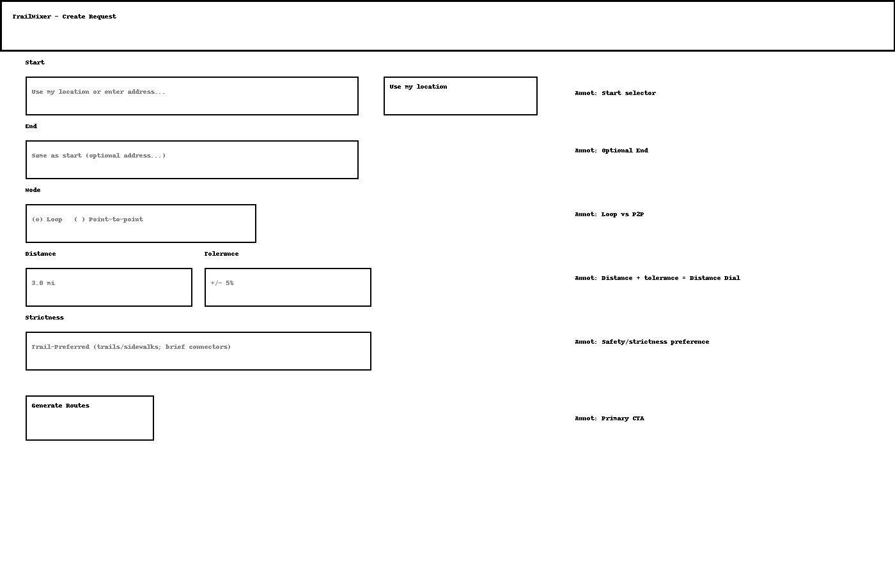
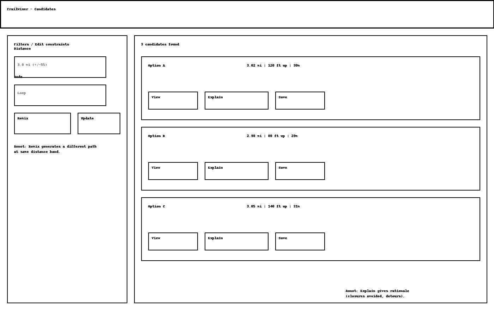
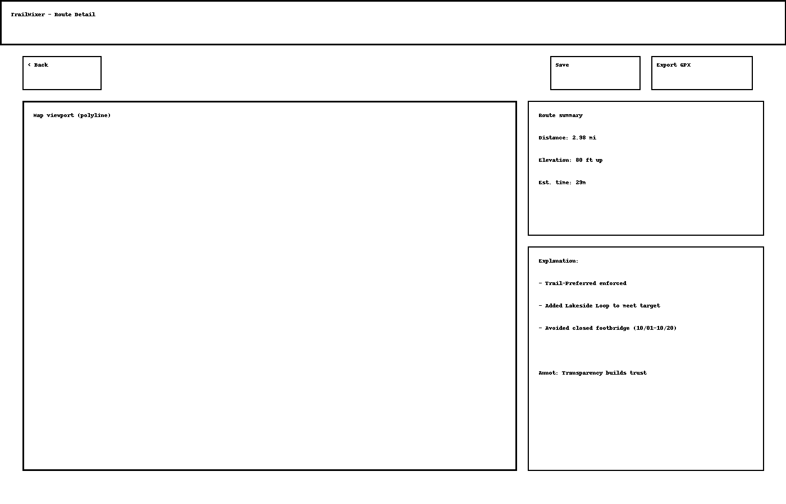
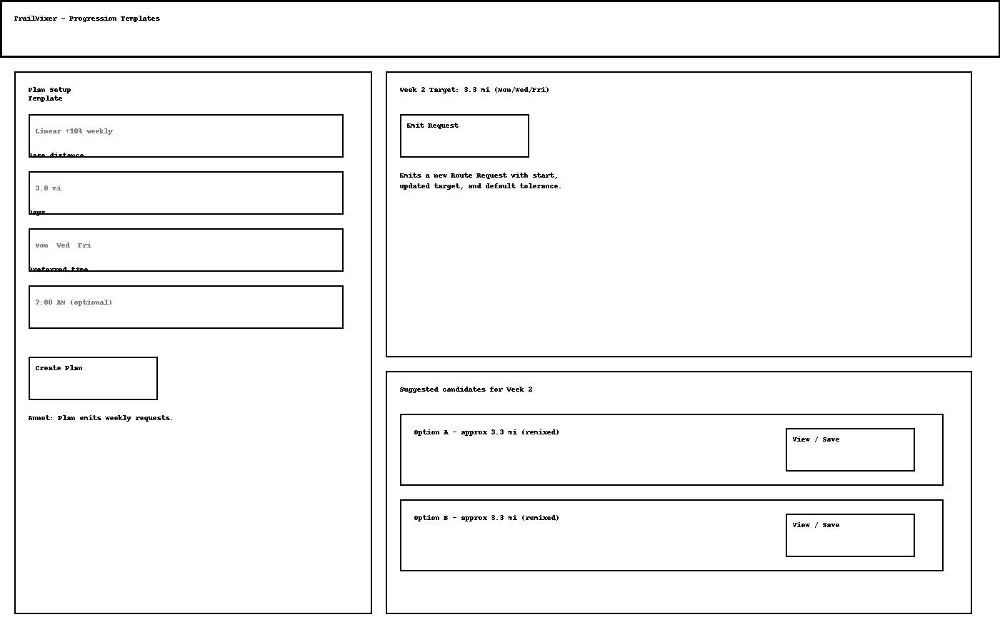

# Assignment 2: Functional Design

# Problem Statement

## Problem Domain: Running and Fitness Route Planning
A major hurdle to getting into running is reducing planning friction so consistency feels easy. Beginner strength programs make it simple to walk into a gym and start; beginner running plans often do not - especially for people who want to run outdoors. Plans prescribe distances, but they don’t tell you where to run, and finding a suitable route becomes the real barrier.

To make this easier, we can automatically design routes for new and casual runners that meets explicit constraints such as distance, starting and ending locations, while staying on pedestrian-friendly paths such as trails or sidewalks. I care about this because I’ve personally felt the friction of “where should I run today?” and found that having a route strongly affects whether I go at all. Lowering that friction can make running more approachable and sustainable.

## Problem
New/casual runners often want a route that starts and ends at a specific location such as their home, dorm, or gym; hits a target distance (e.g., 3.0 mi); and varies across days to stay interesting while remaining on trails sidewalks. Because pedestrian networks are irregular (dead ends, closures, uneven connectivity), getting an exactish distance without tedious waypoint dragging is hard. The result is repetition (same loop every day) or giving up and not running.

## Stakeholders
- **Runners**: Want safe, distance constrained, runnable routes with day to day variety.
- **Run Clubs**: Want repeatable distances from a fixed meetup point.
- **Coaches/Personal Trainers**: Need consistent workloads (distance/time/elevation) for plans.
- **Race Directors (5Ks/Charity Runs)**: Use routing insights for safe, compliant course layouts.
- **Physical Therapists**: Prefer progressive distance/terrain to reduce injury risk.
- **Physicians**: Encourage patients towards safe, sustainable exercise habits with better follow through when given conrete routes.

## Evidence and Comparables

### Evidence
1. [High variety boosts adherence](https://pubmed.ncbi.nlm.nih.gov/26546241/) — Inactive individuals assigned varied exercise routines showed significantly higher adherence than those with repetitive plans, suggesting rotating running routes can sustain consistency.
2. [Runners prioritize environment](https://pmc.ncbi.nlm.nih.gov/articles/PMC6446270/) — Pedestrian comfort factors (greenery, lighting, sidewalks) strongly influence outdoor running willingness. Users want routes that avoid high-traffic segments.
3. [Trail running improves well-being](https://pmc.ncbi.nlm.nih.gov/articles/PMC6388409/) — Trail running supports mindfulness, joint strength, and therapeutic escape from monotony, reinforcing demand for outdoor routes instead of the treadmill.
4. [Sensory-rich routes elevate experience](https://arxiv.org/html/2505.05817v1) — Scents, visuals, and ambient sounds shape runners’ emotional experience and preferences, motivating options that favor green/blue spaces (e.g., trees, oceans, the sky).
5. [Variety and personalization drive motivation](https://arxiv.org/abs/2206.09613) — Personalization and variety in running apps boost intrinsic motivation, validating dynamic route generation and daily “remixes.”
6. [Avoiding route burnout](https://lauranorrisrunning.com/the-benefits-of-varying-your-running-route/) — Varying routes counters mental fatigue and maintains consistency, supporting the need for day to day route variety even at the same distance.
7. [Surface/route diversity reduces injury risk](https://youraustinmarathon.com/important-to-add-running-variety-1/) — Mixing surfaces and routes strengthens different muscles and promotes progression - another argument for flexible and diverse route options.

### Comparables
8. [Strava – Suggested Routes](https://www.tomsguide.com/wellness/fitness/ive-just-tried-strava-premium-and-this-is-the-feature-id-pay-for-twice) — Generates personalized routes by distance/terrain but is paywalled and less focused on fixed start/end or any checkpoints, and distance constraints; often requires manual tweaking.
9. [MapMyRun](https://www.mapmyrun.com/) — Excellent for plotting/sharing GPS routes and discovery, but lacks dynamic daily variations from a fixed start and provides limited support for other constraints.

# Application Pitch - TrailMixer

## Motivation
TrailMixer instantly crafts distance constrained, trail-first running routes from your chosen start (and optional end), offering fresh variations each day without tedious map fiddling.

## Key Features

### Distance Dial
**What**: Set a precise distance target (e.g., 4.0 mi) with a tolerance (e.g., ±4%). The app returns several candidate routes that meet the target from your chosen start (and optional end).

**Why**: Removes waypoint guesswork and makes distance an important constraint, so beginners can start immediately without map fiddling.

**Impact**:
- **Runners**: Reliable mileage means easier adherence to training plans.
- **Clubs**: Repeatable distances from common meet points.
- **Coaches**: Fewer off-route improvisations to “make up distance.”

### Remix
**What**: One-tap Remix generates a different route at the same distance and endpoints.

**Why**: Variety sustains motivation.

**Impact**:
- **Runners**: Less boredom means better consistency.
- **Coaches/Clubs**: Easy weekly route rotation at the same workload.

### Progression Templates

**What**: Weekly templates (e.g., 3.0 to 3.3 to 3.6 mi) that auto-remix routes at each step, keeping the same start and end while gently increasing distance.

**Why**: Provides structured, sustainable progression without heavy training plans; reduces overreach and decision fatigue for beginners.

**Impact**:
- **Runners**: Clear, achievable steps leads to sustainable habit building; lower injury risk.
- **Coaches/PTs**: Simple way to assign progressive workloads without bespoke planning.

# Concepts

- **concept** RouteConstraints [User]
- **purpose** Capture a user’s routing constraints for future route generations.  
- **principle**
    - a user creates a request with constraints
    - user can modify request
    - user can delete request
    - request constraints can be read
- **state**
    - a set of Requests with  
        - an owner User  
        - a title String
        - a start Coord  
        - an end Coord  
        - a target Distance  
        - a tolerance Distance  
- **actions**
    - createReq (owner: User, title: String, start: Coord, end: Coord, target: Distance, tolerance: Distance)
        - **requires** owner User to exist and valid start and end points (i.e., on a map) and distances (i.e., greater than 0)
        - **effect** creates a new Request with owner, title, start, end, target, and tolerance
    - modifyReq (request: Request, owner: User, title: String, start: Coord, end: Coord, target: Distance, tolerance: Distance)
        - **requires** request to exist with same owner User
        - **effect** changes request to new owner, title, start, end, target, and tolerance
    - deleteReq (request: Request)
        - **requires** request to exist
        - **effect** deletes the request and associated information
    - readReq (request: Request): (request: Request)
        - **requires** request to exist
        - **effect** returns request

- **concept** WalkablePaths []
- **purpose** Maintain the walkable graph (sidewalks, paths, trails). 
- **principle**
    - edges can be created and added to possible paths
    - edges can be deleted from graph
    - edges can be upated to available or not
    - set of all edges can be returned
- **state**
    - a set of Edges with
        - a startNode Coord
        - an endNode Coord
        - a length Distance
        - an available Status
- **actions**
    - createEdge (startNode: Coord, endNode: Coord, available: status)
        - **requires** another edge with the same startNode and endNode does not already exist
        - **effect** creates a edge with startNode, endNode, straight line distance - length - between them, and available Status
    - deleteEdge (edge: Edge)
        - **requires** edge to exist
        - **effect** deletes the edge and associated information
    - updateStatus (edge: Edge, available: Status)
        - **requires** edge to exist
        - **effect** updates edge's available status
    - getEdges () : (a set of Edges)
        - **effect** returns a set of all available edges

- **concept** RouteGeneration [User, Request, set of Edges]
- **purpose** Generate candidate routes that satisfy a request. 
- **principle**
    - user can generate route from their constraints and a available paths
    - routes can be deleted
    - routes can be read for display 
- **state**
    - a set of Routes with
        - an owner User
        - a start Coord
        - an end Coord
        - a total Distance
        - a set of Edges with 
            - a startNode Coord
            - an endNode Coord
            - a length Distance
            - an edgeNum int
- **actions**
    - createRoute (owner: User, request: Request, edges: set of Edges)
        - **requires** owner and request to both exist and have the same owner, available edges to exist
        - **effect** creates a new route with owner, start, end, total distance summed from used edges, and a set of edges that: connect with incrementing edgeNums, have start near a startNode with edgeNum = 1, end near a endNode, and total distance within tolerance of target distance
    - deleteRoute (owner: User, route: Route)
        - **requires** owner and request to both exist and have the same owner
        - **effect** deletes the route and associated information
    - readRoute (owner: User, request: Request): (a set of Edges)
        - **requires** owner and request to both exist and have the same owner
        - **effect** returns a set of Edges from route

# Syncs

- **sync** createReq
- **when**
    - Request.createReq (owner: User, title: String, start: Coord, end: Coord, target: Distance, tolerance: Distance)
- **then**
    - RouteConstraints.createReq (owner: User, title: String, start: Coord, end: Coord, target: Distance, tolerance: Distance)

- **sync** createRoute
- **when**
    - Request.createRoute (owner: User, request: Request)
    - WalkablePaths.getEdges () : (edges: a set of Edges)
- **then**
    - RouteGeneration.createRoute (owner: User, request: Request, edges)

- **sync** viewRoute
- **when**
    - Request.viewRoute (owner: User, request: Request)
- **then**
    - RouteGeneration.readRoute (owner, request): (a set of Edges)

### Notes
In TrailMixer, RouteConstraints serves as the intent container: it stores a user’s start/end, target distance, and tolerance, with ownership recorded as owner: User; it has no knowledge of graphs or algorithms and simply captures constraints that features like Distance Dial and Remix reuse. WalkablePaths is the authoritative pedestrian network, maintaining generic edges (startNode, endNode, length, available) and exposing the current usable set via getEdges(); it is completely agnostic to users, requests, and routes, acting only as a data source. RouteGeneration is the solver/explainer that, given a (User, Request, set<Edges>), constructs candidate routes that connect edge-to-edge, start near the request’s start, end near its end, and land within target ± tolerance; it can also return a route for display or delete it, but never mutates constraints or the network. Data flows declaratively through syncs: when a request is created or modified, RouteConstraints emits constraints, WalkablePaths provides the usable edges, and RouteGeneration builds a candidate; if edges change (status update or deletion), affected routes are invalidated and optionally regenerated; when a request is read, the most recent route is surfaced. Generic types are bound as follows: User is the authenticated app user; Request is the identifier from RouteConstraints; Edge is the structural element from WalkablePaths (treated generically—only endpoints, length, availability are required); and Coord/Distance are primitive types with minimal assumptions (e.g., distance > 0). Independence is preserved because RouteConstraints never inspects edge internals, WalkablePaths never inspects user or request internals, and RouteGeneration depends only on public state/actions from the other two; ownership checks occur only at action boundaries (e.g., create/read route), keeping access control separate from graph and routing logic.

# UI Sketches
### Sketch 1

### Sketch 2

### Sketch 3

### Sketch 4

# User Journey
Alex,  a beginner runner, wants simple 3-mile morning runs from home and to build up gradually without getting bored.

Trigger & Goal Setting (Sketch 1).
After deciding to start running three days a week, Alex opens TrailMixer. The app geolocates their apartment as Start; End defaults to “same as start.” Alex selects Loop, enters Distance 3.0 mi and Tolerance ±5% (the Distance Dial), then taps Generate Routes.

Review Candidates & Choose (Sketch 2).
TrailMixer displays three candidates between 2.98–3.05 mi. Each shows elevation and ETA. Alex taps Explain on “Option B.” The explanation notes a closed footbridge nearby and a small lakeside detour used to hit the target.

Route Detail & Trust (Sketch 3).
On the detail screen, the map viewport highlights Option B. The right panel repeats distance/elevation and shows the Explain items. Satisfied, Alex taps Save and Export GPX to their watch. They go run the route before work.

Variety the Next Day (Sketch 2).
Two days later, Alex opens the same request and presses Remix; TrailMixer returns a fresh loop at the same distance band. Alex saves Option C this time to keep things interesting while keeping mileage steady.

Gentle Progression (Sketch 4).
After the first week, Alex sets up a Progression Template: base 3.0 mi, days Mon/Wed/Fri, linear +10% weekly. For Week 2, the app shows 3.3 mi as the target and offers Emit Request. Alex taps it; a new request is created with the updated target and default tolerance. Suggested remixed candidates at ~3.3 mi appear—Alex picks one.

Outcome.
Planning friction is gone: Alex reliably hits distance targets, sees new routes each run, and progresses safely week to week. The combination of Distance Dial, Remix, and Progression Templates keeps Alex engaged and on track.